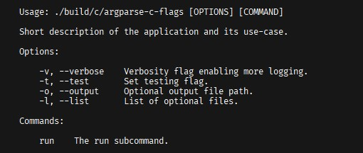
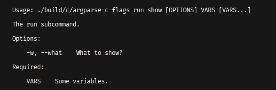

# CLI Argument Parser for C/C++

This repository provides a CLI argument parser library for plain C and C++. The implementation utilizing plain C is located in `./c/`. The C++ version utilizing some C++20 features is located in `./cxx/`.
Check out the examples in the respective directory for a quickstart.

## Impressions

    <h2 align="center">Help Interface</h2>
    

        
    

    <h2 align="center">Help of Subcommand 'run'</h2>
    

        
    

    <h2 align="center">Help of Subcommand 'run show'</h2>
    

        
    

